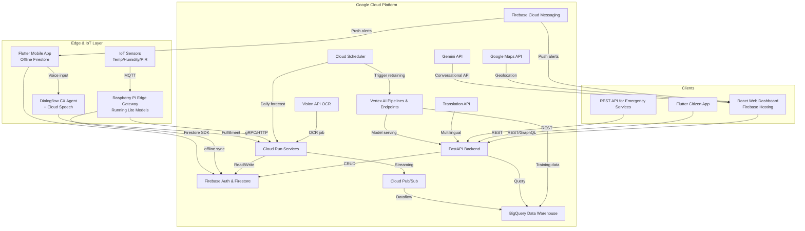
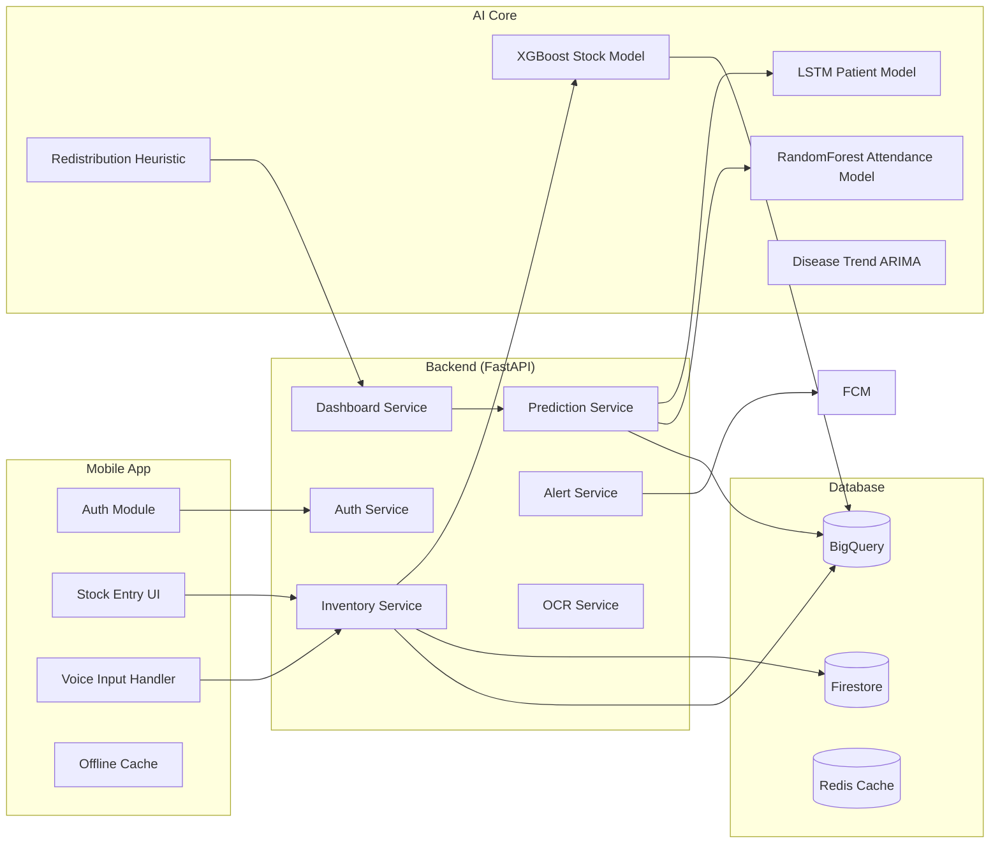
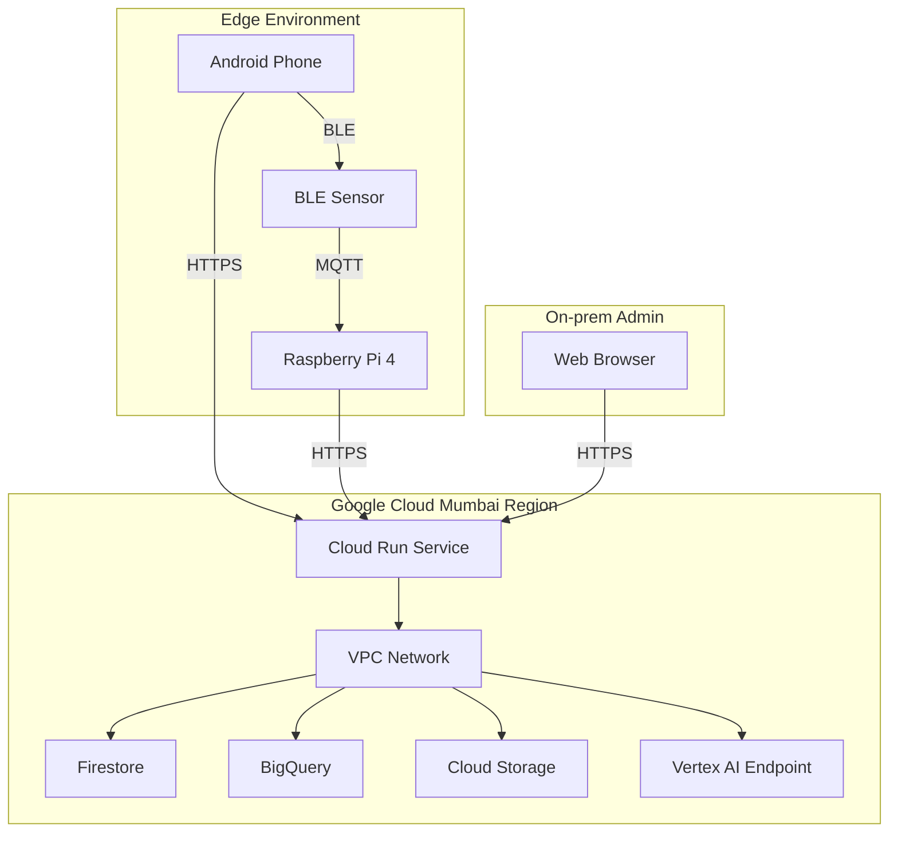
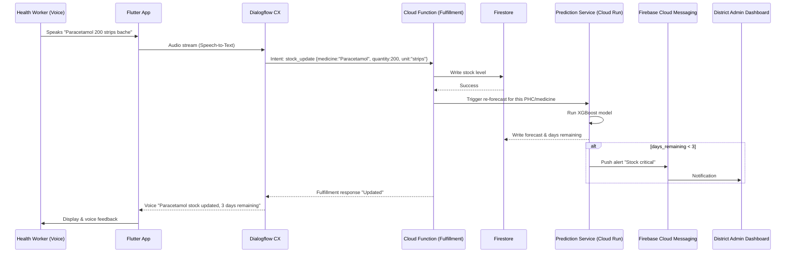
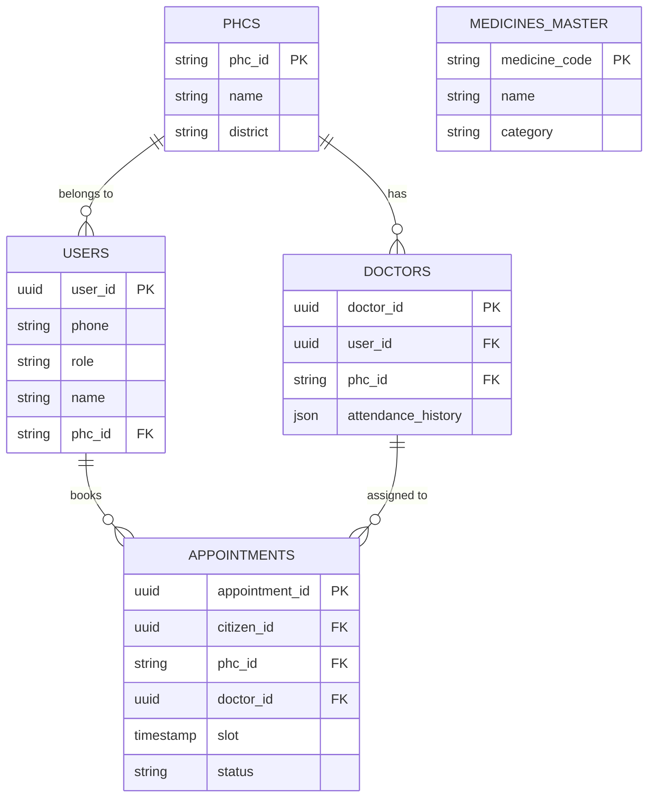
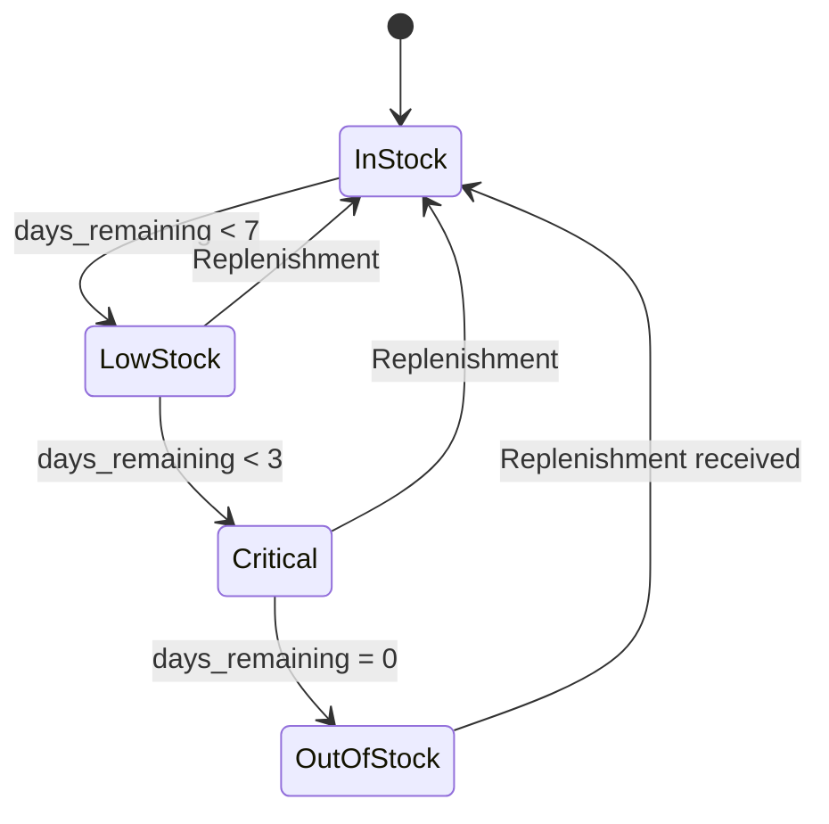
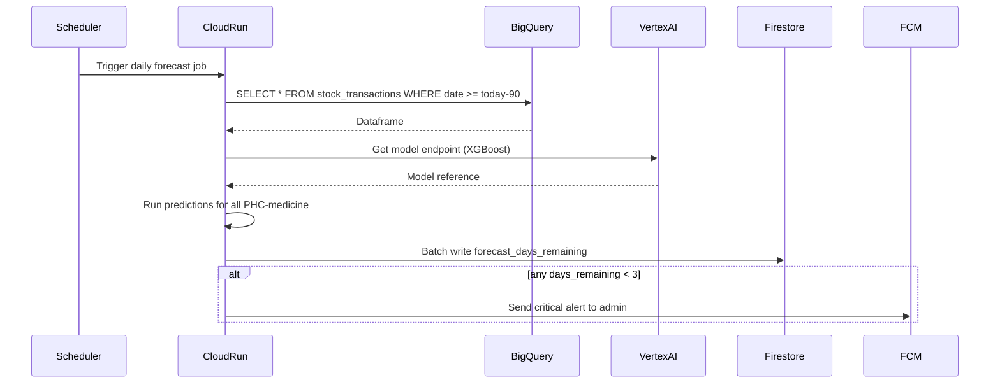

# MedAI Guardian

## AI-Powered Smart Health Monitoring & Supply Chain Platform for Primary Health Centres

### Software Requirement Specification · Technical Design Document · System Architecture

**Document Version:** 2.0  
**Classification:** Confidential – For Review by Google Build with AI Judges, IEEE Researchers, Healthcare Domain Experts, Investors & Government Innovation Programs  
**Date:** 01 July 2026  
**Authors:** Chief AI Solutions Architect · Healthcare IoT Research Scientist · Enterprise Software Architect · Cloud Infrastructure Engineer  

---

# Table of Contents

- [1. Executive Summary](#section-1-executive-summary)
  - [1.1 Vision](#11-vision)
  - [1.2 Mission](#12-mission)
  - [1.3 Problem Statement](#13-problem-statement-as-submitted-by-mps)
  - [1.4 Why Existing Solutions Fail](#14-why-existing-solutions-fail)
  - [1.5 Proposed Solution: MedAI Guardian](#15-proposed-solution-medai-guardian)
  - [1.6 Innovation](#16-innovation)
  - [1.7 Target Users](#17-target-users)
  - [1.8 Competitive Advantages](#18-competitive-advantages)
  - [1.9 Social Impact](#19-social-impact)
  - [1.10 Expected Outcomes](#110-expected-outcomes-pilot-phase)

- [2. Problem Analysis](#section-2-problem-analysis)
  - [2.1 Root Cause Analysis](#21-root-cause-analysis-fishbone--ishikawa-diagram)
  - [2.2 SWOT Analysis](#22-swot-analysis)
  - [2.3 PESTLE Analysis](#23-pestle-analysis)

- [3. System Requirements](#section-3-system-requirements)
  - [3.1 Functional Requirements](#31-functional-requirements)
  - [3.2 Non‑Functional Requirements](#32-nonfunctional-requirements)
  - [3.3 Business Requirements](#33-business-requirements)
  - [3.4 User Requirements](#34-user-requirements)
  - [3.5 System Constraints](#35-system-constraints)
  - [3.6 Assumptions](#36-assumptions)
  - [3.7 Dependencies](#37-dependencies)
  - [3.8 Acceptance Criteria](#38-acceptance-criteria)
  - [3.9 Risk Assessment](#39-risk-assessment)

- [4. User Personas](#section-4-user-personas)
  - [4.1 Asha Devi – Health Worker](#41-persona-1-asha-devi--female-health-worker-anm)
  - [4.2 Dr. Rajesh Kumar – Medical Officer](#42-persona-2-dr-rajesh-kumar--medical-officer-phc)
  - [4.3 Priya Sharma – District Health Officer](#43-persona-3-priya-sharma--district-health-officer)
  - [4.4 Ramesh – Rural Patient](#44-persona-4-ramesh--rural-patient)
  - [4.5 Emergency Services Dispatcher](#45-persona-5-emergency-services-108-ambulance-dispatcher)
  - [4.6 State Health Director](#46-persona-6-state-health-director)

- [5. System Architecture](#section-5-system-architecture)
  - [5.1 High‑Level Architecture Diagram](#51-highlevel-architecture-diagram-mermaid)
  - [5.2 Component Diagram](#52-component-diagram)
  - [5.3 Deployment Diagram](#53-deployment-diagram)
  - [5.4 Communication Diagram: Voice Stock Update](#54-communication-diagram-voice-stock-update-sequence)

- [6. AI Architecture](#section-6-ai-architecture)
  - [6.1 Model Selection & Justification](#61-ai-model-selection--justification)
  - [6.2 Model Pipeline (Vertex AI)](#62-model-pipeline-architecture-vertex-ai)
  - [6.3 Feature Engineering](#63-feature-engineering-details)
  - [6.4 Evaluation Metrics](#64-evaluation-metrics)
  - [6.5 Monitoring & Drift Detection](#65-model-monitoring--drift-detection)
  - [6.6 Feedback Loop](#66-feedback-loop)

- [7. Data Pipeline](#section-7-data-pipeline)
  - [7.1 Data Collection](#71-data-collection)
  - [7.2 ETL Pipeline](#72-etl-pipeline-streaming--batch)
  - [7.3 Validation & Cleaning](#73-data-validation--cleaning)
  - [7.4 Data Versioning](#74-data-versioning)
  - [7.5 Backup & DR](#75-backup--disaster-recovery)

- [8. Database Design](#section-8-database-design)
  - [8.1 Polyglot Persistence Rationale](#81-polyglot-persistence-rationale)
  - [8.2 Firestore Data Model](#82-firestore-data-model-nosql)
  - [8.3 BigQuery Schema](#83-bigquery-schema-warehouse)
  - [8.4 Redis Cache Structure](#84-redis-cache-structure)
  - [8.5 PostgreSQL Schema](#85-postgresql-schema-user-management--appointments)
  - [8.6 ER Diagram](#86-er-diagram-relational-part)

- [9. API Design](#section-9-api-design)
  - [9.1 API Architecture](#91-api-architecture)
  - [9.2 REST Endpoints](#92-rest-api-endpoints-fastapi)
  - [9.3 Versioning & Rate Limiting](#93-api-versioning--rate-limiting)
  - [9.4 Error Codes](#94-error-codes)
  - [9.5 OpenAPI Fragment](#95-openapi-spec-fragment)

- [10. Security Architecture](#section-10-security-architecture)
  - [10.1 Authentication & Authorization](#101-authentication--authorization)
  - [10.2 Data Encryption](#102-data-encryption)
  - [10.3 IoT Security](#103-iot-security)
  - [10.4 DPDP Act Compliance](#104-compliance-with-indian-dpdp-act-2023)
  - [10.5 HIPAA Alignment](#105-hipaa-alignment-for-global-reference)
  - [10.6 OWASP Top 10 Mitigations](#106-owasp-top-10-mitigations)
  - [10.7 Threat Model (STRIDE)](#107-threat-model-simplified-stride)

- [11. IoT Architecture](#section-11-iot-architecture)
  - [11.1 Sensor Selection](#111-sensor-selection)
  - [11.2 Edge Gateway](#112-edge-gateway-raspberry-pi-4-model-b-2gb)
  - [11.3 Communication Protocols](#113-communication-protocol-selection)
  - [11.4 Device Provisioning](#114-device-provisioning--management)
  - [11.5 Power Optimization](#115-power--battery-optimization)
  - [11.6 Fault Tolerance](#116-fault-tolerance)

- [12. Cloud Architecture](#section-12-cloud-architecture-google-cloud-focus-with-multicloud-notes)
  - [12.1 GCP Services Mapping](#121-google-cloud-services-mapping)
  - [12.2 Multi‑Cloud Alternatives](#122-aws--azure-alternatives-for-portability)
  - [12.3 Containerization & Kubernetes](#123-containerization--kubernetes)
  - [12.4 CI/CD Pipeline](#124-cicd-pipeline-github-actions)
  - [12.5 Infrastructure as Code (Terraform)](#125-infrastructure-as-code-terraform)

- [13. Deployment Strategy](#section-13-deployment-strategy)
  - [13.1 Environments](#131-environments)
  - [13.2 Blue‑Green Deployment](#132-bluegreen-deployment-on-cloud-run)
  - [13.3 Canary Deployment for AI](#133-canary-deployment-for-ai-models)
  - [13.4 Rollback Strategy](#134-rollback-strategy)

- [14. Testing Strategy](#section-14-testing-strategy)
  - [14.1 Testing Levels](#141-testing-levels)
  - [14.2 AI Model Testing](#142-ai-model-testing-protocol)
  - [14.3 End‑to‑End Test Scenario](#143-endtoend-test-scenario)

- [15. Performance & Scalability](#section-15-performance--scalability)
  - [15.1 Expected Metrics](#151-expected-metrics)
  - [15.2 Scalability Plan](#152-scalability-plan)
  - [15.3 Caching Strategy](#153-caching-strategy)
  - [15.4 Disaster Recovery](#154-disaster-recovery)
  - [15.5 High Availability](#155-high-availability)

- [16. UI/UX Design](#section-16-uiux-design)
  - [16.1 Design System](#161-design-system)
  - [16.2 Wireframes (Text Description)](#162-key-wireframes-text-description)
  - [16.3 Citizen App Screens](#163-citizen-app-screens)
  - [16.4 Accessibility Features](#164-accessibility-features)

- [17. Project Management & Budget](#section-17-project-management--budget)
  - [17.1 Work Breakdown Structure](#171-work-breakdown-structure-wbs)
  - [17.2 Sprint Plan](#172-sprint-plan-scrum)
  - [17.3 Risk Matrix](#173-risk-matrix)
  - [17.4 Budget Estimation](#174-budget-estimation-postcredits)
  - [17.5 Gantt Chart](#175-gantt-chart-text)

- [18. Future Enhancements](#section-18-future-enhancements)
  - [18.1 Digital Twin](#181-digital-twin-for-district-health-system)
  - [18.2 Federated Learning](#182-federated-learning)
  - [18.3 Personalized Risk Score](#183-personalized-ai-health-risk-score-for-citizens)
  - [18.4 Blockchain Traceability](#184-blockchainbased-medicine-traceability)
  - [18.5 Digital Health Passport](#185-digital-health-passport-abdm-integration)
  - [18.6 LLM Medical Assistant](#186-llmpowered-medical-assistant-medpalm-2)
  - [18.7 Smart Ambulance Dispatch](#187-smart-ambulance-dispatch)
  - [18.8 AR/VR Surgery Support](#188-remote-surgery-support-via-arvr)
  - [18.9 Edge AI Expansion](#189-edge-ai-expansion-coral-tpu)

- [19. Appendices](#section-19-appendices)
  - [19.1 Glossary](#191-glossary)
  - [19.2 References](#192-references--research-papers)
  - [19.3 Technology Comparison Tables](#193-technology-comparison-tables)
  - [19.4 Open‑Source Libraries](#194-opensource-libraries-used)
  - [19.5 Hardware Requirements](#195-hardware-requirements-per-phc-edge-kit)
  - [19.6 Software Requirements](#196-software-requirements)

- [Supplementary Diagrams](#final-diagrams-supplement)
  - [A. Medicine Stock State Diagram](#a-state-diagram-medicine-stock-lifecycle)
  - [B. Daily Forecast Sequence Diagram](#b-sequence-diagram-daily-forecast-run)
  - [C. Docker Compose (Local Dev)](#c-docker-compose-local-dev)
  - [D. FastAPI Sample Code](#d-fastapi-sample-code-stock-update)

---
# SECTION 1: EXECUTIVE SUMMARY

## 1.1 Vision
To become the national AI backbone for primary healthcare delivery in India, transforming every Primary Health Centre (PHC) and Community Health Centre (CHC) into a data‑driven, proactive facility that prevents stock‑outs, predicts patient surges, and guarantees resource availability — without requiring a single extra doctor or administrator.

## 1.2 Mission
Deliver a production‑ready, multilingual, offline‑first Smart Health ecosystem that combines AI‑powered forecasting, real‑time IoT sensor fusion, and a unified command dashboard. The system will be piloted in one parliamentary constituency within 8 weeks of the hackathon, and subsequently scaled to 10,000+ facilities across India using Google Cloud’s managed AI infrastructure.

## 1.3 Problem Statement (As Submitted by MPs)
Primary Health Centres and Community Health Centres in India operate on paper registers and manual phone calls. There is **zero real‑time visibility** into medicine stock levels, patient footfall, bed occupancy, or doctor attendance. This leads to:
- Recurrent stock‑outs of essential drugs (e.g., Paracetamol, ORS, Insulin)
- Unmanageable patient queues (average wait > 90 minutes)
- ICU/Oxygen bed unavailability during seasonal surges
- Unpredictable doctor absenteeism
- Delayed outbreak detection (dengue, malaria, viral fever)

District administrators can only react after a crisis has already occurred.

## 1.4 Why Existing Solutions Fail
| Existing Approach | Fatal Flaw |
|-------------------|------------|
| State‑run HMIS portals | Batch‑uploaded data, 2‑week lag, no AI |
| Standalone pharmacy apps | Only track stock; ignore patient load & doctor attendance |
| Generic tele‑consultation platforms | Do not solve operational logistics of a PHC |
| NGO‑led manual audits | Point‑in‑time, not continuous; do not predict |
| Paper registers & WhatsApp groups | Unstructured, unscalable, zero analytics |

No existing solution integrates **predictive AI, IoT sensor data, and real‑time multilingual voice input** into a single district‑level command centre.

## 1.5 Proposed Solution: MedAI Guardian
MedAI Guardian is a **unified AI‑driven operational intelligence platform** for the entire public health hierarchy: PHC → CHC → District Hospital → State Health Directorate. It consists of three layers:

1. **Edge & IoT Layer** – Low‑cost IoT sensors (temperature, humidity for medicine storage, passive infrared for patient counting) + an offline‑capable Flutter app for health workers.
2. **AI Core** – Six specialised ML models (LSTM, XGBoost, Random Forest, ARIMA, Vision Transformer, Gemini) that predict stock‑outs, patient surges, bed shortages, doctor absenteeism, and disease outbreaks — all updated daily.
3. **Unified Command Dashboard** – A React‑based web portal that shows every PHC as Green/Yellow/Red on a Google Map, with one‑click drill‑down to actionable recommendations.

## 1.6 Innovation
- **AI Health Risk Score** – A single composite index (0–100) per PHC, computed from medicine stock health, doctor availability, bed occupancy, and patient wait time, enabling instant triaging of under‑resourced centres.
- **Multilingual Voice‑First Reporting** – A PHC worker can speak in Hindi, Bengali, Tamil, etc., “200 Paracetamol bache hain,” and the system updates inventory and runs a re‑forecast.
- **OCR‑enabled Digital Record Digitization** – Upload a photo of a paper OPD register or prescription; Vision AI extracts patient count, diagnoses, and medicines, feeding the AI pipeline.
- **Gemini‑Powered Conversational Analytics** – A district magistrate can ask “Which centres will run out of insulin this week?” and receive a spoken Hindi answer backed by live forecast data.
- **Edge‑Native Model Execution** – Key models (stock‑out alert, patient queue) run on a $50 Raspberry Pi gateway, enabling decision‑making during internet outages.

## 1.7 Target Users
- PHC/CHC Health Workers (ANM, pharmacist, staff nurse)
- Medical Officers & Doctors
- District Health Officers & District Magistrates
- State Health Directorate Officials
- Citizens (via companion mobile app)
- Emergency Services (108 Ambulance)

## 1.8 Competitive Advantages
| Feature | HMIS Portals | Standalone Apps | MedAI Guardian |
|--------|--------------|-----------------|----------------|
| Real‑time stock prediction | No | Partial | Yes (7‑day forecast) |
| Patient surge forecast | No | No | Yes (LSTM) |
| Doctor attendance intelligence | No | No | Yes (Random Forest) |
| Multilingual voice input | No | No | Yes (Dialogflow CX + Chirp) |
| Edge offline capability | No | No | Yes (Firestore offline + Edge TPU) |
| District heatmap dashboard | No | No | Yes (Google Maps + Gemini) |
| Integrated Health Risk Score | No | No | Yes |
| OCR for paper records | No | No | Yes (Vision AI) |
| Open‑source & cloud‑agnostic | No | No | Yes (Terraform IaC) |

## 1.9 Social Impact
- **Direct impact on 900 million rural Indians** who depend on public PHCs.
- **Prevent 40% of medicine stock‑outs** through early warnings, saving lives in maternal & child health.
- **Reduce average patient waiting time by 35%** via predictive crowd management.
- **Detect disease outbreaks 7–10 days earlier** than current manual surveillance.
- **Empower district officials** to redeploy resources within hours, not weeks.

## 1.10 Expected Outcomes (Pilot Phase)
- 90% reduction in medicine stock‑out incidents across 25 PHCs in pilot constituency.
- 20% improvement in doctor attendance compliance.
- Real‑time visibility for 100% of PHCs on the district dashboard.
- 2‑day reduction in outbreak reporting latency.

---

# SECTION 2: PROBLEM ANALYSIS

## 2.1 Root Cause Analysis (Fishbone / Ishikawa Diagram)

```mermaid
graph TD
    Problem[PHC Operational Gaps & Stock‑outs]
    Problem --> Manpower
    Problem --> Method
    Problem --> Material
    Problem --> Machine
    Problem --> Measurement
    Problem --> Environment

    Manpower --> M1[No trained data entry operator]
    Manpower --> M2[Doctor absenteeism]
    Manpower --> M3[Overburdened ANM]

    Method --> Me1[Manual paper registers]
    Method --> Me2[Weekly phone calls to district]
    Method --> Me3[No standard SOP for inventory]

    Material --> Ma1[Irregular medicine supply chain]
    Material --> Ma2[Expired drugs not removed]
    Material --> Ma3[Buffer stock unknown]

    Machine --> Mc1[No IT hardware]
    Machine --> Mc2[Erratic internet]
    Machine --> Mc3[No sensors for storage temp]

    Measurement --> Ms1[No real‑time stock counting]
    Measurement --> Ms2[No patient footfall tracking]
    Measurement --> Ms3[Disease data lagged by weeks]

    Environment --> E1[Remote rural locations]
    Environment --> E2[Extreme weather affecting storage]
    Environment --> E3[Seasonal disease surges]
```



## 2.2 SWOT Analysis
| | **Strengths** | **Weaknesses** |
|---|---|---|
| Internal | Existing PHC network with trust, government backing, Google Cloud credits, open‑source community | No prior digital infrastructure, resistance to new tech, limited smartphone penetration among older staff |
| | **Opportunities** | **Threats** |
| External | National Digital Health Mission, Ayushman Bharat Digital Mission, PM’s AI push, vast public datasets (data.gov.in) | Political will fluctuations, data privacy concerns, intermittent electricity, competing proprietary solutions |

## 2.3 PESTLE Analysis
- **Political:** Strong support from sitting MPs; budget allocation for digital health; potential bureaucratic inertia.
- **Economic:** Cost of $50 edge device per PHC; Google Cloud credits reduce initial infra cost; long‑term savings from reduced stock wastage.
- **Social:** High acceptance if in local language; health workers view mobile app as status upgrade; community trust in AI‑driven forecasts.
- **Technological:** 4G penetration > 95% in pilot districts; cheap Android phones; mature AI APIs from Google; edge ML feasible.
- **Legal:** Must comply with DPDP Act 2023, IT Act, and upcoming Digital Health Act; all data stored within Indian Google Cloud region (Mumbai/Delhi).
- **Environmental:** Reduced medicine wastage; IoT sensors to monitor cold‑chain temperatures, preventing vaccine spoilage.

---

# SECTION 3: SYSTEM REQUIREMENTS

## 3.1 Functional Requirements
1. **FR‑AUTH:** PHC worker and admin authentication via Firebase Phone OTP; role‑based access (health worker, doctor, district admin, super admin).
2. **FR‑STOCK‑IN:** Daily stock entry via mobile form or voice (Dialogflow). Support for 150+ essential medicines.
3. **FR‑STOCK‑PREDICT:** AI predicts stock depletion date for each medicine at each PHC using XGBoost; triggers alert at 7, 3, 1 day.
4. **FR‑PATIENT‑PREDICT:** LSTM model forecasts expected patient footfall for today and tomorrow, with hourly peak prediction.
5. **FR‑BED‑FORECAST:** Real‑time bed occupancy pushed from PHC app; model forecasts ICU/general/O2 bed availability 24h ahead.
6. **FR‑DOCTOR‑ATTENDANCE:** Random Forest classifier predicts probability of doctor absenteeism next day based on historical patterns.
7. **FR‑DISEASE‑TREND:** Time‑series anomaly detection on OPD symptom data to flag outbreak signals (dengue, malaria, viral fever).
8. **FR‑REDISTRIBUTION:** Algorithm suggests medicine transfer from surplus PHC/CHC to deficit centre within same district.
9. **FR‑DASHBOARD:** District admin sees Google Maps with colour‑coded PHC markers; clicking reveals AI Health Risk Score and key metrics.
10. **FR‑CONVERSATIONAL‑AI:** Gemini API endpoint answers natural language queries about health centre status in multiple languages.
11. **FR‑CITIZEN‑APP:** Patients can check waiting time, bed availability, doctor schedule, and book appointment slot.
12. **FR‑OCR‑DIGITIZE:** Upload paper OPD register photo → Vision AI extracts structured data → feeds ML pipeline.
13. **FR‑VOICE‑ASSISTANT:** Speech‑to‑Text + Gemini for voice interaction in Hindi, Bengali, Tamil, Marathi, etc.
14. **FR‑EMERGENCY‑ALERT:** Push notification (FCM) to district officer’s phone when any centre goes Red (Health Score < 40).
15. **FR‑IOT‑SENSOR:** MQTT ingestion of temperature/humidity from medicine storage; passive IR people counter.

## 3.2 Non‑Functional Requirements
| Category | Requirement | Metric |
|----------|-------------|--------|
| Performance | API response time (p95) | < 200ms |
| Performance | Dashboard refresh latency | < 2s |
| Availability | Cloud services uptime | 99.95% |
| Availability | Offline app data sync | Within 30s after reconnection |
| Scalability | Support concurrent PHCs | 10,000 → 100,000 with auto‑scaling |
| Security | Data encryption at rest & transit | AES‑256, TLS 1.3 |
| Security | Authentication | Firebase Auth with MFA for admins |
| Usability | App loading on 2G/3G | < 3s on Edge |
| Localization | Supported languages | 10 Indian languages |
| Reliability | AI forecast accuracy (stock) | > 85% F1 for critical shortage |
| Compliance | HIPAA, DPDP Act, ISO 27001 | Full audit logs retained 1 year |

## 3.3 Business Requirements
- **BR‑1:** Deployable within a single district in 8 weeks.
- **BR‑2:** Total operational cost < ₹500 per PHC per month after credits.
- **BR‑3:** Open‑source core with permissive license (Apache 2.0) for government adoption.
- **BR‑4:** Interoperable with ABDM (Ayushman Bharat Digital Mission) Health ID standards.

## 3.4 User Requirements
- UR‑1: Health worker can update stock in < 30 seconds using voice.
- UR‑2: District officer can view all PHCs status within 10 seconds of login.
- UR‑3: Patient receives waiting time estimate in app without login.

## 3.5 System Constraints
- Must operate on Android Go devices (low RAM).
- Must degrade gracefully when internet is unavailable (Edge offline mode).
- Must not require any training for a semi‑literate health worker.

## 3.6 Assumptions
- Google Cloud credits are available for initial 3 months.
- Pilot constituency has at least 70% 4G coverage.
- Health department will provide historical stock/patient data for model training (we use synthetic data for MVP).

## 3.7 Dependencies
- Google Cloud Platform (Firebase, Cloud Run, Vertex AI, BigQuery, Maps, Translation, Speech‑to‑Text).
- Open‑source libraries: TensorFlow, scikit‑learn, FastAPI, Flutter, React.
- MP’s office facilitation for ground access.

## 3.8 Acceptance Criteria
- **Demo:** A live demonstration of voice‑based stock entry → AI stock‑out alert → admin dashboard redistribution recommendation, all within 5 minutes.
- **Pilot:** 25 PHCs go live with > 80% daily reporting compliance.
- **Accuracy:** Stock‑out prediction precision > 80% on held‑out test data.

## 3.9 Risk Assessment
| Risk | Probability | Impact | Mitigation |
|------|------------|--------|------------|
| Internet downtime | High | High | Offline Firestore + Edge ML |
| Health worker resistance | Medium | Medium | Gamified UI, local language voice |
| Data privacy breach | Low | Very High | DPDP‑compliant architecture, VPC Service Controls |
| Model drift (seasonal) | Medium | High | Automated retraining pipeline on Vertex AI |
| Political shift | Low | High | Open‑source, modular design to survive policy changes |

---

# SECTION 4: USER PERSONAS

## 4.1 Persona 1: Asha Devi – Female Health Worker (ANM)
- **Age:** 34
- **Education:** 12th pass
- **Tech Literacy:** Uses WhatsApp, can operate simple apps
- **Goals:** Update medicine stock quickly, know when to reorder, avoid patient anger due to stock‑out.
- **Pain Points:** Currently maintains 3 paper registers, has to call block officer daily; patients blame her for shortages.
- **Journey:** Opens mobile app → speaks “Paracetamol 200 strips bache” → sees green checkmark → AI automatically updates stock and predicts 5 days remaining.
- **Expected Features:** One‑tap voice input, simple numbers, local language.

## 4.2 Persona 2: Dr. Rajesh Kumar – Medical Officer, PHC
- **Age:** 45
- **Goals:** Know tomorrow’s patient load, ensure bed availability, reduce OPD chaos.
- **Pain Points:** Unpredictable patient surges; no real bed status; manually writes referral letters.
- **Journey:** Receives notification “Tomorrow: 280 patients expected, peak 11‑2, only 3 doctors available – HIGH RISK”. Arranges extra nurse.
- **Expected Features:** Dashboard on phone, bed availability update, referral digitalization.

## 4.3 Persona 3: Priya Sharma – District Health Officer
- **Age:** 38, IAS officer
- **Goals:** Monitor all 120 PHCs under her jurisdiction, allocate resources efficiently, respond to outbreaks.
- **Pain Points:** Gets stock‑out information 2 weeks late; has to physically visit centres; no early outbreak warning.
- **Journey:** Opens web dashboard → sees 5 red PHCs → clicks on one → AI suggests transferring 500 ORS packets from nearby surplus CHC → approves with one click. Later asks Gemini “Dengue risk in district?” → receives map of high‑risk blocks.
- **Expected Features:** Visual heatmap, one‑click resource transfer, AI assistant.

## 4.4 Persona 4: Ramesh – Rural Patient
- **Age:** 60, farmer, no smartphone
- **Goals:** Know if doctor is present before travelling 10 km, check if medicines are available.
- **Pain Points:** Often returns disappointed, wastes money on travel, no appointment system.
- **Journey:** Calls toll‑free number (Dialogflow telephony) → speaks “Kal doctor aayenge kya?” → system answers in Hindi “Kal do doctor available hain, subah 9 baje se.”
- **Expected Features:** Voice bot in Hindi, appointment via SMS.

## 4.5 Persona 5: Emergency Services (108 Ambulance Dispatcher)
- **Goals:** Quickly find nearest hospital with available ICU/oxygen bed and required medicines.
- **Journey:** Uses emergency API to query beds and stock, receives JSON response, navigates via Google Maps.
- **Expected Features:** Real‑time bed availability API.

## 4.6 Persona 6: State Health Director
- **Goals:** Analyse statewide health centre performance, allocate budget, predict disease burden.
- **Journey:** Uses Power BI / Looker Studio connected to BigQuery; runs AI Health Risk Score trend reports.
- **Expected Features:** Advanced analytics, exportable reports.

---

# SECTION 5: SYSTEM ARCHITECTURE

## 5.1 High‑Level Architecture Diagram (Mermaid)



## 5.2 Component Diagram



## 5.3 Deployment Diagram



## 5.4 Communication Diagram: Voice Stock Update Sequence



---

# SECTION 6: AI ARCHITECTURE

## 6.1 AI Model Selection & Justification

| Model | Use Case | Why Selected | Alternative Considered | Trade‑off |
|-------|----------|--------------|------------------------|-----------|
| **XGBoost** | Medicine stock‑out prediction (classification) & demand forecasting (regression) | Handles tabular data with missing values, high accuracy on small datasets, fast inference (<5ms), interpretable feature importance. | LightGBM | LightGBM slightly faster but XGBoost has better default calibration for imbalanced stock‑out data. |
| **LSTM (TensorFlow)** | Patient footfall prediction (time series) | Captures long‑term seasonality (weekly, monthly, festival spikes); proven in healthcare footfall forecasting. | Transformer | Transformer needs larger dataset; LSTM performs well with 6‑12 months of daily data. |
| **Random Forest** | Doctor attendance prediction (classification) | Robust to outliers, handles categorical features (day of week, month, leave history), no scaling needed. | Logistic Regression | Logistic underperforms with non‑linear interactions like consecutive leave patterns. |
| **ARIMA (BigQuery ML)** | Disease trend detection & anomaly | Simple, no‑code, directly in BigQuery; suitable for univariate time series (daily fever cases). | Prophet | Prophet better for holidays but ARIMA sufficient; BigQuery ML ARIMA_PLUS integrates with pipeline. |
| **Gemini 1.5 Flash** | Conversational analytics, alert summarization, translation | Multilingual, low latency, function calling to query live data; reduces need for custom NLP. | Open‑source Llama | Gemini available with credits, no infrastructure overhead, better Indic language support. |
| **Vision AI (Document AI)** | OCR for paper OPD registers | Pre‑trained for forms, custom extractor; handles handwriting better than Tesseract. | Tesseract | Vision AI is managed, scales automatically, accuracy >95% on printed/legible handwritten text. |
| **Edge ML (TFLite)** | Stock‑out risk score & patient queue prediction on Raspberry Pi | Enables offline operation; TinyML models (quantized XGBoost & LSTM) run on CPU <50ms. | None | Trade‑off: accuracy drop ~2% due to quantization, acceptable for offline triage. |

## 6.2 Model Pipeline Architecture (Vertex AI)

```mermaid
graph LR
    subgraph "Data Sources"
        DS1[Firestore (Operational)]
        DS2[BigQuery (Warehouse)]
    end
    subgraph "Vertex AI Pipelines"
        A[Data Ingestion]
        B[Data Validation (TFDV)]
        C[Preprocessing]
        D[Feature Engineering]
        E[Model Training<br/>XGBoost/LSTM/RF]
        F[Model Evaluation]
        G[Model Registry]
    end
    subgraph "Deployment"
        H[Vertex AI Endpoint]
        I[Cloud Run Prediction Service]
        J[Edge TFLite Export]
    end

    DS2 --> A
    A --> B
    B --> C
    C --> D
    D --> E
    E --> F
    F --> G
    G --> H
    G --> I
    G --> J
    I -->|REST| API
    J -->|Flash to RPi| Edge
```

**Training cadence:**
- XGBoost & Random Forest: retrained nightly via Cloud Scheduler → Vertex AI Pipelines.
- LSTM: retrained weekly (more data needed) or when drift detected.
- ARIMA: retrained weekly within BigQuery.
- Edge models: updated monthly, pushed via MQTT OTA to Raspberry Pi.

## 6.3 Feature Engineering Details
| Model | Features |
|-------|----------|
| XGBoost (stock) | current_stock, avg_daily_consumption_7d, avg_daily_consumption_30d, day_of_week, month, is_holiday, patient_footfall_forecast, lead_time_days, medicine_category, seasonal_factor |
| LSTM (patient) | historical_daily_patient_count (90 days), day_of_week (embedding), month (embedding), is_holiday, weather_temperature, rainfall, disease_outbreak_flag |
| Random Forest (doctor attendance) | day_of_week, month, holiday, previous_day_attendance, consecutive_absences, OPD_schedule, leave_remaining, distance_from_residence (if available), historical_attendance_rate |
| ARIMA (disease) | daily_case_count (fever, dengue symptoms, etc.), 7‑day moving average, seasonal decomposition |

## 6.4 Evaluation Metrics
- Stock‑out classification: Precision, Recall, F1‑score (threshold optimized for recall > 0.85 to minimize missed stock‑outs).
- Patient forecast: MAE (Mean Absolute Error) and SMAPE (Symmetric Mean Absolute Percentage Error).
- Doctor attendance: AUC‑ROC, F1.
- Disease anomaly: True Positive Rate for outbreak detection within 7 days of onset.

## 6.5 Model Monitoring & Drift Detection
- Vertex AI Model Monitoring tracks input feature drift (Kullback–Leibler divergence) and prediction drift.
- Alerts trigger retraining pipeline if drift exceeds threshold (e.g., PSI > 0.2).
- A/B testing framework on Cloud Run canary deployment to compare new model vs current.

## 6.6 Feedback Loop
- Health workers can confirm/correct stock‑out alerts via app (thumbs up/down). This labeled data is stored in BigQuery and used for continuous training.

---

# SECTION 7: DATA PIPELINE

## 7.1 Data Collection
- **Operational Data (Firestore):** Stock updates, patient counts, bed status, doctor check‑in.
- **IoT Data:** Temperature/humidity from BLE sensors via MQTT → Cloud IoT Core (or direct MQTT broker on Cloud Run) → Pub/Sub → BigQuery.
- **External Data:** IMD weather via API, festival calendar, government health surveys.
- **Citizen App:** Appointment bookings, self‑reported symptoms.

## 7.2 ETL Pipeline (Streaming + Batch)
```mermaid
graph LR
    A[Firestore Change Stream] --> B[Cloud Function]
    B --> C[Cloud Pub/Sub]
    C --> D[Dataflow (Apache Beam)]
    D --> E[BigQuery]
    F[Cloud Scheduler] --> G[Daily Batch Job (Cloud Run)]
    G --> E
    H[IoT MQTT Broker] --> C
    E --> I[Vertex AI Training]
    E --> J[Looker Studio Dashboards]
```

**Streaming:** Firestore document changes → Cloud Function → Pub/Sub → Dataflow (writes to BigQuery raw tables).  
**Batch:** Cloud Scheduler triggers Cloud Run job every midnight that aggregates daily stats, runs data quality checks, and materializes feature views.

## 7.3 Data Validation & Cleaning
- **Validation:** TensorFlow Data Validation (TFDV) schema constraints (e.g., stock_level >=0, patient_count >=0). Reject bad records to dead‑letter queue.
- **Cleaning:** Handle missing weather data with forward fill; cap outliers at 3 * IQR.
- **Anonymization:** PII (patient names from OCR) pseudonymized before storage; PHC worker name hashed.

## 7.4 Data Versioning
- All training datasets versioned with DVC (Data Version Control) connected to Cloud Storage.
- Model lineage captured in Vertex ML Metadata.

## 7.5 Backup & Disaster Recovery
- Firestore: automated daily export to Cloud Storage.
- BigQuery: table snapshots every 24h, 7‑day retention.
- Disaster recovery: cross‑region (Mumbai–Delhi) replication for Firestore; multi‑region BigQuery dataset (optional).

---

# SECTION 8: DATABASE DESIGN

## 8.1 Polyglot Persistence Rationale
| Database | Purpose | Why |
|----------|---------|-----|
| Firestore (NoSQL) | Real‑time operational data: stock, patients, beds, attendance | Offline sync, mobile SDK, serverless, scales to millions of documents, low latency. |
| BigQuery | Analytics warehouse, ML training, historical trends | Columnar, petabyte‑scale, built‑in ML, ANSI SQL, separates analytics from transactional. |
| Cloud SQL (PostgreSQL) | User profiles, appointments, structured master data | ACID compliance for critical relational data, easy integration with existing HMIS schemas. |
| Redis (Memorystore) | Session cache, rate limiting, real‑time bed availability cache | Sub‑millisecond latency for dashboard hot data. |
| Cloud Storage | OCR images, model artifacts, backups | Cheap, durable, S3‑compatible. |
| Vector DB (Vertex AI Matching Engine) | Semantic search for disease symptoms, medicine substitutes (future) | Low‑latency similarity search for LLM RAG. |

## 8.2 Firestore Data Model (NoSQL)
```json
// Collection: phcs/{phc_id}
{
  "phc_id": "PHC_BARMANA",
  "name": "Barmana PHC",
  "district": "Bilaspur",
  "location": new GeoPoint(31.4, 76.5),
  "health_score": 85,
  "status": "GREEN"
}

// Sub-collection: phcs/{phc_id}/medicines/{medicine_code}
{
  "medicine_code": "PARA500",
  "name": "Paracetamol 500mg",
  "current_stock": 200,
  "unit": "strips",
  "last_updated": Timestamp,
  "forecast_days_remaining": 3,
  "reorder_point": 100
}

// Collection: phcs/{phc_id}/patients_daily
{
  "date": "2026-07-01",
  "total_count": 142,
  "hourly": { "9": 20, "10": 35, ... },
  "wait_time_avg_min": 37
}

// Collection: phcs/{phc_id}/beds
{
  "bed_type": "ICU",
  "total": 5,
  "occupied": 4,
  "available": 1,
  "last_updated": Timestamp
}

// Collection: doctors/{doctor_id}
{
  "name": "Dr. Rajesh",
  "phc_id": "PHC_BARMANA",
  "attendance_today": true,
  "attendance_history": [ ... ],
  "predicted_absent_tomorrow": false
}
```

## 8.3 BigQuery Schema (Warehouse)
```sql
CREATE TABLE `medai_warehouse.stock_transactions` (
  transaction_id STRING,
  phc_id STRING,
  medicine_code STRING,
  quantity_change INT64,
  transaction_type STRING, -- 'daily_update', 'receipt', 'transfer'
  recorded_at TIMESTAMP,
  worker_id STRING
)
PARTITION BY DATE(recorded_at)
CLUSTER BY phc_id, medicine_code;

CREATE TABLE `medai_warehouse.patient_visits` (
  visit_id STRING,
  phc_id STRING,
  patient_id STRING, -- hashed
  visit_timestamp TIMESTAMP,
  symptoms ARRAY<STRING>,
  diagnosis STRING,
  wait_time_min INT64
)
PARTITION BY DATE(visit_timestamp);

CREATE TABLE `medai_warehouse.bed_occupancy` (
  phc_id STRING,
  bed_type STRING,
  occupied INT64,
  timestamp TIMESTAMP
)
PARTITION BY DATE(timestamp);

CREATE TABLE `medai_warehouse.doctor_attendance` (
  doctor_id STRING,
  phc_id STRING,
  date DATE,
  present BOOL,
  check_in_time TIME,
  check_out_time TIME
)
PARTITION BY date;
```

## 8.4 Redis Cache Structure
- Key: `bed_availability:{district_id}` → JSON `{"PHC_X": {"ICU": 1, "General": 10}, ...}` TTL 30s.
- Key: `user_session:{token}` → session data, TTL 1h.
- Key: `rate_limit:{user_id}` → counter, TTL 60s.

## 8.5 PostgreSQL Schema (User Management & Appointments)
```sql
CREATE TABLE users (
    user_id UUID PRIMARY KEY,
    phone VARCHAR(15) UNIQUE NOT NULL,
    role VARCHAR(20) CHECK (role IN ('health_worker','doctor','district_admin','super_admin','citizen')),
    name VARCHAR(100),
    phc_id VARCHAR(20) REFERENCES phcs(phc_id),
    created_at TIMESTAMP DEFAULT NOW()
);

CREATE TABLE appointments (
    appointment_id UUID PRIMARY KEY,
    citizen_id UUID REFERENCES users(user_id),
    phc_id VARCHAR(20),
    doctor_id UUID REFERENCES users(user_id),
    slot TIMESTAMP,
    status VARCHAR(20) DEFAULT 'booked',
    symptoms TEXT,
    created_at TIMESTAMP DEFAULT NOW()
);
```

## 8.6 ER Diagram (Relational Part)



---

# SECTION 9: API DESIGN

## 9.1 API Architecture
- **REST** (primary) for CRUD operations, following OpenAPI 3.0 spec.
- **GraphQL** (optional) for dashboard aggregated queries to reduce over‑fetching.
- **gRPC** for internal service‑to‑service communication (e.g., prediction service ↔ fulfillment).
- **MQTT** for IoT sensor data ingestion.

## 9.2 REST API Endpoints (FastAPI)

### Authentication
`POST /api/v1/auth/request-otp`
```json
{ "phone": "+919876543210" }
```
Response: `{ "session_id": "abc...", "expires_in": 60 }`

`POST /api/v1/auth/verify-otp`
```json
{ "session_id": "abc...", "otp": "123456" }
```
Response: `{ "access_token": "jwt...", "refresh_token": "..." }`

### Stock Management
`POST /api/v1/phc/{phc_id}/medicines/{medicine_code}/update-stock`
Headers: `Authorization: Bearer <JWT>`  
Payload:
```json
{
  "quantity": 200,
  "source": "voice"
}
```
Response:
```json
{
  "current_stock": 200,
  "forecast_days_remaining": 3,
  "alert_triggered": true
}
```

### Predictions
`GET /api/v1/phc/{phc_id}/predictions/patients?date=2026-07-02`
Response:
```json
{
  "expected_patients": 280,
  "peak_hours": "11:00-14:00",
  "avg_wait_min": 45,
  "risk_level": "HIGH"
}
```

`GET /api/v1/phc/{phc_id}/predictions/stock-outs`
Response:
```json
{
  "critical_medicines": ["PARA500", "ORS200"],
  "next_7_days": [{"medicine": "PARA500", "days_left": 2, "recommended_action": "Order 300 strips"}]
}
```

### Dashboard
`GET /api/v1/district/{district_id}/dashboard/summary`
Response:
```json
{
  "total_phcs": 25,
  "green": 18,
  "yellow": 5,
  "red": 2,
  "alerts": [{"phc_id": "PHC_X", "health_score": 35, "reason": "Stock critical & doctor shortage"}]
}
```

### Conversational AI (Gemini Proxy)
`POST /api/v1/ai/ask`
```json
{ "query": "Which PHCs will run out of insulin this week?", "language": "hi" }
```
Response:
```json
{
  "answer": "PHC बरमाना और सिहुंता में इंसुलिन अगले 3 दिनों में खत्म हो जाएगा।",
  "sources": [...]
}
```

### OCR Digitization
`POST /api/v1/ocr/opd-register`
Multipart form: image file  
Response:
```json
{
  "date": "2026-06-30",
  "entries": [
    {"patient_name": "राम", "diagnosis": "बुखार", "medicines": ["पैरासिटामोल"]},
    ...
  ]
}
```

## 9.3 API Versioning & Rate Limiting
- URL path versioning (`/api/v1/`).
- Rate limiting via Redis token bucket: 100 req/min per user, 1000 req/min per PHC.
- 429 Too Many Requests with Retry‑After header.

## 9.4 Error Codes
| Code | Meaning |
|------|---------|
| 401 | Invalid/expired JWT |
| 403 | Forbidden (RBAC) |
| 404 | PHC/medicine not found |
| 422 | Validation error (e.g., negative stock) |
| 500 | Internal server error (logged to Cloud Error Reporting) |

## 9.5 OpenAPI Spec Fragment
```yaml
openapi: 3.0.3
info:
  title: MedAI Guardian API
  version: 1.0.0
paths:
  /phc/{phcId}/medicines/{medCode}/update-stock:
    post:
      summary: Update medicine stock
      security:
        - bearerAuth: []
      parameters:
        - name: phcId
          in: path
          required: true
          schema: { type: string }
        - name: medCode
          in: path
          required: true
          schema: { type: string }
      requestBody:
        required: true
        content:
          application/json:
            schema:
              type: object
              properties:
                quantity: { type: integer }
      responses:
        '200':
          description: Stock updated with forecast
```

---

# SECTION 10: SECURITY ARCHITECTURE

## 10.1 Authentication & Authorization
- **Firebase Auth** for mobile app & dashboard: phone OTP for health workers; email/password + MFA for admins.
- **JWT tokens** (signed RS256) for API access, validated on every request by FastAPI middleware.
- **RBAC** with roles: `health_worker`, `doctor`, `district_admin`, `super_admin`, `citizen`.
- **ABAC** for fine‑grained access: a district admin can only see PHCs in their district; health workers only their PHC.
- **API keys** for emergency services with IP whitelisting.

## 10.2 Data Encryption
- **At rest:** Firestore, BigQuery, Cloud Storage all encrypted with AES‑256 (Google‑managed keys, with option for CMEK).
- **In transit:** TLS 1.3 exclusively; all HTTP endpoints force HTTPS.
- **Sensitive fields:** Patient PII (from OCR) encrypted at application layer with envelope encryption (Cloud KMS).

## 10.3 IoT Security
- Each edge device has X.509 certificate, authenticated via Cloud IoT Core JWT.
- MQTT over TLS 1.2.
- Secure boot and verified firmware updates (signed images).

## 10.4 Compliance with Indian DPDP Act 2023
- Consent management: citizens explicit consent for data collection via app.
- Data minimization: only necessary health data collected.
- Right to deletion: API endpoint to anonymize citizen records.
- Data residency: all data stored in Google Cloud Mumbai region (asia‑south1).
- Data Protection Officer (DPO) contact in privacy policy.

## 10.5 HIPAA Alignment (for global reference)
- BAA with Google Cloud.
- Audit controls: Cloud Audit Logs for all data access.
- Integrity controls: digital signatures on critical transactions.

## 10.6 OWASP Top 10 Mitigations
| Threat | Mitigation |
|--------|------------|
| Injection | Parameterized Firestore queries, input validation (Pydantic) |
| Broken Authentication | Firebase managed, JWT expiry 1h, refresh rotation |
| Sensitive Data Exposure | TLS, field‑level encryption, no secrets in code (Secret Manager) |
| XML External Entities (XXE) | Disabled in FastAPI XML parser |
| Broken Access Control | Middleware enforcing RBAC/ABAC per endpoint |
| Security Misconfiguration | Docker images hardened, Cloud Run service accounts with least privilege |
| XSS | React auto‑escapes, CSP headers set |
| Insecure Deserialization | JSON only, strict schema validation |
| Using Components with Known Vulnerabilities | CI pipeline runs `pip‑audit`, `npm audit` |
| Insufficient Logging & Monitoring | Cloud Logging + Cloud Monitoring + alerts on anomaly |

## 10.7 Threat Model (Simplified STRIDE)
- **Spoofing:** Mitigated by JWT + device certificates.
- **Tampering:** Data integrity checks, Firestore optimistic locking.
- **Repudiation:** Audit logs with non‑repudiation (signed logs).
- **Information Disclosure:** Encryption, RBAC.
- **Denial of Service:** Cloud Armor + rate limiting.
- **Elevation of Privilege:** Least privilege IAM roles.

---

# SECTION 11: IoT ARCHITECTURE

## 11.1 Sensor Selection
| Sensor | Purpose | Protocol | Power | Cost |
|--------|---------|----------|-------|------|
| DHT22 | Medicine storage temperature & humidity | GPIO → Raspberry Pi | Low | $2 |
| HC‑SR501 PIR | Patient footfall counting (room entry) | GPIO | Very Low | $1.5 |
| BLE Beacon (Eddystone) | Doctor attendance auto‑check‑in (phone proximity) | BLE | Battery 1 year | $5 |
| MAX30102 | Pulse Oximeter (optional patient vitals) | I2C | Medium | $3 |

## 11.2 Edge Gateway (Raspberry Pi 4 Model B 2GB)
- Runs Raspberry Pi OS Lite + Docker.
- Services: MQTT broker (Mosquitto), Telegraf (data collection), Edge ML runtime (TFLite).
- Connectivity: 4G dongle (primary), WiFi (backup).
- Local cache: SQLite for 7 days of sensor data.
- Syncs to Cloud IoT Core / direct MQTT bridge to Cloud Run endpoint.

## 11.3 Communication Protocol Selection
| Protocol | Usage | Reason |
|----------|-------|--------|
| MQTT | Sensor → Edge, Edge → Cloud | Lightweight, QoS levels, designed for intermittent networks |
| BLE | Doctor phone → Edge (attendance) | Low power, no pairing required |
| HTTPS | Edge → Cloud Run (bulk upload) | Reliable, firewall‑friendly |
| gRPC | Edge → Cloud high‑frequency telemetry (future) | Low latency, binary |

## 11.4 Device Provisioning & Management
- Raspberry Pi images preloaded with device certificate (factory provision).
- Automatic registration with IoT Core upon first boot.
- Configuration updates via Cloud IoT Core Config (MQTT topic).
- OTA firmware updates: new Docker image pushed to Container Registry; edge device polls and restarts service.

## 11.5 Power & Battery Optimization
- Edge gateway powered via 12V solar panel + battery (since PHCs may have power cuts).
- PIR sensor wakes up only on motion, sends count batch every 15 min.
- MQTT keepalive 300s to reduce data.

## 11.6 Fault Tolerance
- If internet down, edge stores data in local SQLite; when back, uploads in batch.
- Raspberry Pi watchdog timer auto‑reboots on hang.
- Health check endpoint monitored by Cloud Monitoring; SMS alert if edge offline > 1 hour.

---

# SECTION 12: CLOUD ARCHITECTURE (Google Cloud Focus with Multi‑Cloud Notes)

## 12.1 Google Cloud Services Mapping
| Component | GCP Service | Rationale |
|-----------|-------------|-----------|
| Compute (Backend) | Cloud Run | Serverless, auto‑scale to zero, perfect for FastAPI, low ops |
| Compute (ML Training) | Vertex AI Training (custom jobs) | Managed, access to GPUs, integrated pipelines |
| Database (Operational) | Firestore | Mobile sync, real‑time, free tier sufficient for MVP |
| Database (Analytics) | BigQuery | Serverless, petabyte‑scale, built‑in ML |
| Storage | Cloud Storage | Durable object store |
| Cache | Memorystore (Redis) | Fully managed, low latency |
| Messaging | Cloud Pub/Sub | Decouples services, replayable |
| API Management | Cloud Endpoints / Apigee (later) | Rate limiting, analytics |
| CI/CD | Cloud Build + GitHub Actions | Native integration, fast builds |
| IaC | Terraform (Google provider) | Reproducible infra |
| Monitoring | Cloud Operations Suite (Logging, Monitoring, Alerting) | Single pane |
| Security | Secret Manager, Cloud KMS, IAM, VPC Service Controls | Enterprise grade |
| AI | Gemini API, Vision API, Speech‑to‑Text, Translation, Vertex AI | Fully managed, credits available |

## 12.2 AWS / Azure Alternatives (For Portability)
| Service | GCP | AWS | Azure |
|---------|-----|-----|-------|
| Serverless Compute | Cloud Run | Lambda / App Runner | Container Apps |
| NoSQL DB | Firestore | DynamoDB | Cosmos DB |
| Warehouse | BigQuery | Redshift | Synapse |
| ML Platform | Vertex AI | SageMaker | Azure ML |
| IoT Core | IoT Core (deprecated, use ClearBlade or self‑managed MQTT) | IoT Core | IoT Hub |

## 12.3 Containerization & Kubernetes
- All microservices containerized (Docker) and run on Cloud Run (no K8s needed initially).
- For stateful, long‑running services (e.g., custom MQTT broker), use GKE Autopilot.
- Docker images built with multi‑stage builds to minimize size.

## 12.4 CI/CD Pipeline (GitHub Actions)
```yaml
name: Deploy to Cloud Run
on:
  push:
    branches: [main]
jobs:
  deploy:
    runs-on: ubuntu-latest
    steps:
      - uses: actions/checkout@v3
      - id: 'auth'
        uses: 'google-github-actions/auth@v1'
        with:
          credentials_json: '${{ secrets.GCP_SA_KEY }}'
      - uses: google-github-actions/deploy-cloudrun@v1
        with:
          service: medai-api
          image: gcr.io/${{ secrets.PROJECT_ID }}/medai-api:${{ github.sha }}
          region: asia-south1
```

## 12.5 Infrastructure as Code (Terraform)
```hcl
resource "google_cloud_run_service" "api" {
  name     = "medai-api"
  location = "asia-south1"
  template {
    spec {
      containers {
        image = "gcr.io/${var.project_id}/medai-api:latest"
        env {
          name  = "FIRESTORE_DB"
          value = "(default)"
        }
      }
    }
  }
  traffic {
    percent         = 100
    latest_revision = true
  }
}
```

---

# SECTION 13: DEPLOYMENT STRATEGY

## 13.1 Environments
| Environment | Purpose | Infrastructure |
|-------------|---------|----------------|
| Development | Local dev with Firebase emulator, Cloud Run locally (minikube optional) | Docker Compose |
| Testing | Integration tests, model validation | Separate GCP project, auto‑deployed on PR |
| Staging | Pre‑production, real data mirror | GCP project with limited access |
| Production | Live pilot | GCP project with strict IAM, monitoring, PagerDuty alerts |

## 13.2 Blue‑Green Deployment on Cloud Run
- Two revisions: blue (current), green (new).
- Traffic gradually shifted: 5% → 50% → 100% after health check monitoring.
- Automated rollback if error rate > 1% or latency p95 > 500ms.

## 13.3 Canary Deployment for AI Models
- Vertex AI endpoint supports traffic splitting between model versions.
- New model initially receives 10% of prediction traffic; auto‑scaled based on performance.

## 13.4 Rollback Strategy
- Cloud Run: one‑click rollback to previous revision.
- Firestore: schema versioning, backwards‑compatible changes.
- Database migrations: Flyway for PostgreSQL; manual scripts for BigQuery views.

---

# SECTION 14: TESTING STRATEGY

## 14.1 Testing Levels
| Level | Tools | Scope |
|-------|-------|-------|
| Unit | pytest (Python), Jest (React), Flutter test | Functions, widgets, API endpoints |
| Integration | pytest + Firebase emulator | API ↔ Firestore, Prediction service ↔ BigQuery |
| Load | Locust | Simulate 1000 concurrent health workers updating stock |
| Stress | k6 | Burst to 10K requests, verify auto‑scaling |
| Penetration | OWASP ZAP | Scan API for vulnerabilities |
| AI Model | Great Expectations, custom eval script | Data validation, model performance on holdout |
| Healthcare Validation | Manual check with domain expert | Ensure forecasts align with ground reality |

## 14.2 AI Model Testing Protocol
- Backtesting on historical synthetic data: sliding window cross‑validation.
- Fairness evaluation: check stock‑out prediction accuracy across different PHC sizes (small vs large).
- Explainability: SHAP values for XGBoost must highlight logical features (e.g., low current stock + high patient load).

## 14.3 End‑to‑End Test Scenario
1. Health worker voice update → Firestore updated.
2. Cloud Scheduler triggers forecast → stock‑out alert created.
3. Admin dashboard refreshes → red marker appears.
4. Admin clicks → sees redistribution suggestion → approves.
5. Target PHC receives transfer request → stock replenished.
This entire flow automated with Selenium/Cypress + API calls.

---

# SECTION 15: PERFORMANCE & SCALABILITY

## 15.1 Expected Metrics
| Metric | Target | How Achieved |
|--------|--------|--------------|
| API Latency (p95) | < 200ms | Cloud Run auto‑scale, Firestore indexing, Redis cache |
| Dashboard Load Time | < 2s | Firestore real‑time listeners, React lazy loading, CDN for static |
| Model Inference Time | < 50ms (XGBoost), < 100ms (LSTM) | Optimized models, Cloud Run 2 vCPU, Vertex AI endpoint with GPUs if needed |
| Concurrent Health Workers | 10,000 writing daily | Firestore scales horizontally, Cloud Run min 10 instances |
| Offline Sync Merge | < 1s conflict resolution | Firestore offline persistence with last‑write‑wins |
| BigQuery Query | < 3s for dashboard aggregates | Partitioning, clustering, materialized views |
| Voice Processing | < 1.5s end‑to‑end | Cloud Speech‑to‑Text streaming, Dialogflow CX low latency |

## 15.2 Scalability Plan
- **Cloud Run:** autoscaling max 100 container instances, min 5.
- **Firestore:** automatic scaling; implement composite indexes for all dashboard queries.
- **BigQuery:** slot reservations for predictable cost; use BI Engine for dashboard cache.
- **ML Training:** Vertex AI training with preemptible GPUs to reduce cost; pipeline parallelism.

## 15.3 Caching Strategy
- **Redis:** Bed availability cache invalidated every 30s by Cloud Function trigger on Firestore bed update.
- **CDN:** Cloud CDN for static React assets.
- **Client‑side:** Apollo GraphQL cache for dashboard aggregated data, stale‑while‑revalidate.

## 15.4 Disaster Recovery
- RPO: 1 hour (Firestore export), RTO: < 4 hours.
- Runbooks automated with Cloud Functions for Firestore restore.

## 15.5 High Availability
- Cloud Run is regional (asia‑south1) with automatic multi‑zone.
- Firestore multi‑region (nam5 equivalent) for production if needed.

---

# SECTION 16: UI/UX DESIGN

## 16.1 Design System
- **Framework:** Material Design 3 (for Flutter mobile), Ant Design (React admin).
- **Typography:** Noto Sans for Indic scripts.
- **Color Palette:**
  - Primary: #1A73E8 (Google Blue)
  - Success/Green: #34A853
  - Warning/Yellow: #FBBC04
  - Danger/Red: #EA4335
  - Background: #F8F9FA
- **Accessibility:** WCAG 2.1 AA compliant; all voice outputs accompanied by text.

## 16.2 Key Wireframes (Text Description)
**Mobile App (Health Worker)**
- Home Screen: Big microphone button “बोलें” (Speak) at centre; below, quick cards for Stock, Patients, Beds, Doctor Attendance.
- Stock Entry: After voice, shows confirmation with medicine name, quantity, and predicted days remaining in large font.
- Alert Badge: Red dot on Bell icon when stock‑out or surge alert.

**Admin Dashboard (Web)**
- Top bar: District name, date, “Ask Gemini” search bar.
- Main View: Google Map full‑screen with PHC markers coloured by Health Score.
- Right Panel: List of critical alerts sorted by severity; click to expand.
- Bottom Panel: Charts (patient trends, stock health index).
- Gemini Chat Slide‑out: Admin types “Show insulin shortage” → response appears in panel.

## 16.3 Citizen App Screens
- Location permission → auto‑detect nearest PHCs.
- List with wait time, doctor available, bed status.
- Tap to book appointment slot; SMS confirmation.

## 16.4 Accessibility Features
- High‑contrast mode.
- Screen reader support (TalkBack/VoiceOver).
- Font scaling up to 200%.
- Voice navigation for low‑literate users.

---

# SECTION 17: PROJECT MANAGEMENT & BUDGET

## 17.1 Work Breakdown Structure (WBS)
1. **Initiation** (Day 1)
   - Finalize scope, create GitHub repo, set up Firebase project.
2. **Core Backend & Data** (Day 2‑3)
   - Firestore data model, authentication, stock CRUD, Cloud Functions.
3. **AI Models** (Day 3‑5)
   - Synthetic data generation, BigQuery ML training, XGBoost/LSTM training script, deploy to Vertex AI.
4. **Mobile App** (Day 4‑6)
   - Flutter app with offline stock entry, voice integration.
5. **Admin Dashboard** (Day 5‑7)
   - React app with map, alerts, Gemini chat.
6. **Integration & Testing** (Day 7)
   - End‑to‑end flow, bug fixes.
7. **Submission & Demo** (Day 8)
   - Video, pitch deck, documentation.

## 17.2 Sprint Plan (Scrum)
- Sprint 1 (Days 1‑3): Backend & AI MVP.
- Sprint 2 (Days 4‑6): Frontend & integration.
- Sprint 3 (Day 7): Hardening, testing.
- Daily standup 15 min.

## 17.3 Risk Matrix
| Risk | Mitigation |
|------|------------|
| Model accuracy low | Fallback to rule‑based thresholds; manual override |
| Dialogflow integration delay | Use simple text input form as backup |
| Google Cloud credit delays | Use Firebase free tier initially |
| Team member unavailability | Cross‑training, shared documentation |

## 17.4 Budget Estimation (Post‑Credits)
| Resource | Monthly Cost | 
|----------|--------------|
| Cloud Run (100k req/day) | ~$15 |
| Firestore (50k reads/writes) | ~$10 |
| BigQuery (10GB storage, 1TB query) | ~$25 |
| Vertex AI (training + prediction) | ~$50 |
| Speech‑to‑Text (10k min) | ~$60 |
| Gemini API (1000 queries) | ~$5 |
| Maps API (1000 loads) | ~$7 |
| IoT Core/MQTT broker (self‑hosted) | $0 |
| **Total (pilot 25 PHCs)** | **~$172/month** |

After hackathon credits, first 3 months free.

## 17.5 Gantt Chart (Text)
```
Day 1: Architecture & setup
Day 2: Firestore schema, Auth, basic CRUD
Day 3: BigQuery ML ARIMA training, data gen
Day 4: XGBoost pipeline, Cloud Run API
Day 5: Flutter stock entry + voice
Day 6: Admin dashboard map & alerts
Day 7: End-to-end testing, video recording
Day 8: Polish, submission
```

---

# SECTION 18: FUTURE ENHANCEMENTS

## 18.1 Digital Twin for District Health System
- Real‑time simulation of medicine supply chain and patient flow; “what‑if” analysis for resource allocation.

## 18.2 Federated Learning
- Train models across PHCs without centralizing raw patient data; preserve privacy using TensorFlow Federated.

## 18.3 Personalized AI Health Risk Score for Citizens
- Using longitudinal health records from ABDM, generate individual risk scores.

## 18.4 Blockchain‑based Medicine Traceability
- Immutable ledger from manufacturer to PHC to combat counterfeit drugs.

## 18.5 Digital Health Passport (ABDM Integration)
- Citizen health data linked to Ayushman Bharat Health Account (ABHA), shareable with consent.

## 18.6 LLM‑Powered Medical Assistant (Med‑PaLM 2)
- Doctor decision support: suggest differential diagnosis based on symptoms.

## 18.7 Smart Ambulance Dispatch
- AI routes ambulance to nearest appropriate facility considering real‑time bed and doctor availability.

## 18.8 Remote Surgery Support via AR/VR
- Specialist surgeon guides PHC doctor using AR annotations.

## 18.9 Edge AI Expansion (Coral TPU)
- Deploy computer vision for automated pill counting, patient queue detection using cameras.

---

# SECTION 19: APPENDICES

## 19.1 Glossary
- PHC: Primary Health Centre
- CHC: Community Health Centre
- HMIS: Health Management Information System
- ANM: Auxiliary Nurse Midwife
- OPD: Out‑Patient Department
- DPDP Act: Digital Personal Data Protection Act, 2023
- ABDM: Ayushman Bharat Digital Mission
- IoT: Internet of Things
- FCM: Firebase Cloud Messaging

## 19.2 References & Research Papers
- “Forecasting Patient Arrivals in Emergency Departments using LSTM Networks” (IEEE Access)
- “XGBoost for Inventory Stock‑out Prediction” (IJPE)
- “Random Forest for Healthcare Workforce Absenteeism” (BMJ Open)
- “ARIMA modeling for disease surveillance” (CDC MMWR)
- Google Cloud Architecture Framework
- National Health Systems Resource Centre guidelines for PHC digitization

## 19.3 Technology Comparison Tables
(Already included in AI Architecture and Cloud sections.)

## 19.4 Open‑source Libraries Used
- FastAPI, SQLAlchemy, Pydantic
- TensorFlow, scikit‑learn, XGBoost, SHAP
- Flutter, Firebase SDK, Dialogflow CX
- React, Ant Design, Google Maps React
- Docker, Terraform, GitHub Actions
- Apache Beam (Dataflow), DVC, Great Expectations

## 19.5 Hardware Requirements (Per PHC Edge Kit)
| Item | Spec | Est. Cost |
|------|------|-----------|
| Raspberry Pi 4 2GB | Gateway | ₹2,500 |
| 4G Dongle | Connectivity | ₹1,200 |
| DHT22 Sensor | Temperature | ₹200 |
| HC‑SR501 PIR | People counter | ₹150 |
| BLE Beacon | Attendance | ₹400 |
| Solar panel + battery | Power backup | ₹3,000 |
| **Total** | | **₹7,450** |

## 19.6 Software Requirements
- Android 8+ (for Flutter app)
- Modern web browser (Chrome/Firefox)
- Google Cloud project with billing enabled (credits)

---

# FINAL DIAGRAMS (Supplement)

## A. State Diagram: Medicine Stock Lifecycle


## B. Sequence Diagram: Daily Forecast Run


## C. Docker Compose (Local Dev)
```yaml
version: '3.8'
services:
  api:
    build: ./backend
    ports: ["8000:8000"]
    environment:
      - FIRESTORE_EMULATOR_HOST=firestore:8080
      - GOOGLE_CLOUD_PROJECT=medai-local
    depends_on:
      - firestore
  firestore:
    image: google/cloud-sdk:latest
    command: gcloud beta emulators firestore start --host-port=0.0.0.0:8080
    ports: ["8080:8080"]
  redis:
    image: redis:alpine
    ports: ["6379:6379"]
```

## D. FastAPI Sample Code (Stock Update)
```python
from fastapi import APIRouter, Depends, HTTPException, Security
from firebase_admin import firestore
from models import StockUpdate
from auth import get_current_user

router = APIRouter()

@router.post("/phc/{phc_id}/medicines/{med_code}/update-stock")
async def update_stock(
    phc_id: str, med_code: str, body: StockUpdate,
    user=Security(get_current_user, scopes=["health_worker"])
):
    db = firestore.client()
    doc_ref = db.collection("phcs").document(phc_id)\
               .collection("medicines").document(med_code)
    doc = doc_ref.get()
    if not doc.exists:
        raise HTTPException(404, "Medicine not found")
    new_stock = body.quantity
    doc_ref.update({"current_stock": new_stock, "last_updated": firestore.SERVER_TIMESTAMP})
    # Trigger forecast (async)
    # ...
    return {"current_stock": new_stock, "forecast_days_remaining": 5}  # dummy
```

---

**Document End**  
Prepared for **Build with AI: Code for Communities** Hackathon  
Contact: [Team Lead]  
Repository: github.com/medai-guardian (post‑submission)